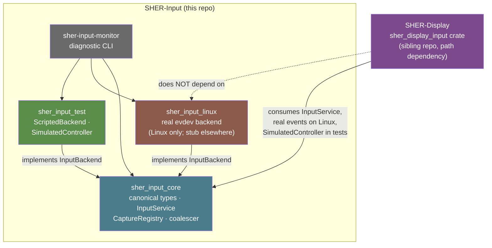

# SHER-Input Architecture

## Why this exists

Every desktop stack eventually has to answer the same question: when a key goes down,
whose problem is it? Answer it wrong and you get one of two failure modes that show up
in almost every compositor eventually — either the display server reaches into raw
device files and grows Linux-specific assumptions all the way through its window and
focus code, or "input handling" gets scattered across drivers, the compositor, and the
toolkit with no single place that knows the true order of events across devices.

SHER-Input exists so that question has one answer, in one place: SHER-Input turns
physical activity into a canonical, ordered, timestamped event; SHER-Display decides
who receives it. Nothing above SHER-Input ever touches a Linux keycode, an evdev path,
or a HID report. Nothing in SHER-Input ever decides which window is focused.

## Layering

```
                    AURORA
                       │
              ┌────────▼────────┐
              │   SHER-DISPLAY  │   focus, surfaces, windows, compositing
              └───────┬─────────┘
                      │
          ┌───────────┴───────────┐
          │                       │
   ┌──────▼───────┐       ┌──────▼───────┐
   │ SHER-INPUT   │       │ SHER-GRAPHICS│
   │ interaction  │       │ rendering    │
   └──────┬───────┘       └──────┬───────┘
          │                       │
          └───────────┬───────────┘
                      │
               ┌──────▼──────┐
               │ SHER-KERNEL │
               └──────┬──────┘
                      │
                  HARDWARE
```

| Layer | Owns | Never touches |
|---|---|---|
| SHER-Kernel | hardware access, device handles, low-level IPC | device semantics, event ordering |
| **SHER-Input** | device discovery/lifecycle, event normalization, keyboard/pointer/touch state, timestamps, sequencing, coalescing, capture contract, synthetic-input policy | windows, surfaces, focus, compositing |
| SHER-Display | surfaces, windows, outputs, focus, pointer-to-surface mapping, grabs | raw device state, evdev/HID details |
| Aurora | desktop UX, widgets, menus, shortcuts | any backend-specific input detail |

SHER-Input is deliberately not a second display server. It has no concept of a
window, and it never decides *which* surface an event goes to — only SHER-Display
does that, using the normalized stream SHER-Input produces plus its own focus and
capture state.

## The canonical event model

```
InputEvent
 ├── timestamp        nanoseconds since UNIX_EPOCH, captured at normalization
 ├── sequence          global monotonic counter — the ordering authority
 ├── device_id         opaque; never a /dev/input path
 ├── source             Physical | Synthetic(origin)
 ├── modifiers          ctrl/alt/shift/super + lock-key state
 └── payload            Keyboard | Pointer | Touch | Tablet | Gamepad
                         | DeviceAdded | DeviceRemoved
```

Two events can legitimately share a timestamp on a fast machine; `sequence` is what
makes "A happened before B" always answerable, across every device, without relying on
clock resolution. New device classes add a payload variant — existing match arms for
other variants are untouched, so extending the model is additive, not a breaking
rewrite (a `DeviceAdded`/`DeviceRemoved` event flows through the exact same ordered
channel as everything else, because hotplug is a normal operating condition, not a
side channel).

## Physical key, logical key, text — kept separate on purpose

A keyboard event is not "the letter that was typed." `PhysicalKey` is the position
that moved (`KeyA` always means the QWERTY-A position); `LogicalKey` is what that
position means under the active layout; `text` is what an input method would insert,
present only where it makes sense. A shortcut binding matches on `LogicalKey`; a text
field consumes `text`; neither has to reconstruct the other.

## Ordering and coalescing

Every event is sequenced before it is delivered, and `PointerMove`/`PointerScroll` are
the only payloads `InputService`'s coalescer is allowed to merge — a `ButtonDown`
event always flushes any pending motion for that device first, so a click can never
be observed out of order relative to the motion that preceded it. A single stray
motion sample is never stuck: a background ticker flushes pending coalesced samples
every 8ms regardless of whether anything else happens, and `InputService::flush_coalesced()`
is exposed for a compositor that wants frame-aligned delivery instead.

## Capture

SHER-Display requests exclusive input (drag, resize, pointer lock, modal, fullscreen)
through `InputService::request_capture`. A capture is single-owner per kind
(`Pointer` / `Keyboard` / `Touch`), returns an RAII guard, and is revoked the moment
that guard drops — there is no other way to end one. SHER-Input tracks *that* a
capture exists and by which named owner, for diagnostics; it never decides whether a
capture request is legitimate. That policy is entirely SHER-Display's.

## Synthetic input

Every event carries `InputSource`, so physical and injected input are never
ambiguous. Submitting synthetic input requires a `SyntheticInputGrant` scoped to both
an origin (`AccessibilityTool`, `AutomatedTesting`, `RemoteDesktop`, `AiAgent`,
`SystemTool`) and an event kind (keyboard/pointer/touch) — there is intentionally no
unrestricted grant. An AI agent given a keyboard-only grant cannot move the pointer;
SHER-Input rejects the attempt before it reaches `InputService`'s normalized stream.

## Backend contract

```rust
trait InputBackend: Send + 'static {
    fn name(&self) -> &'static str;
    fn spawn(self: Box<Self>, sink: BackendEventSink, running: Arc<AtomicBool>)
        -> Result<std::thread::JoinHandle<()>>;
}
```

A backend reports coarse `BackendEvent`s (a physical key transitioned, a device
appeared) through a sink; `InputService` owns everything downstream — layout mapping,
state tracking, sequencing, coalescing. `sher_input_linux::LinuxBackend` and
`sher_input_test::ScriptedBackend` both implement this trait and are interchangeable
from `InputService`'s point of view, which is the whole point: a future SHER-Kernel-
native backend is a third implementation, not a rewrite.

## Crate split and how SHER-Display consumes it

Three crates in this repo, each isolating something real — not one per
device class, and not a speculative plugin system:



`sher_input_linux` and `sher_input_test` both implement the same
`InputBackend` trait and are interchangeable from `InputService`'s point of
view — that's the whole point of the trait (see "Backend contract" above).
SHER-Display only ever depends on `sher_input_core` (for the real,
production path) and `sher_input_test` (to drive its own tests
deterministically); it has no reason to depend on `sher_input_linux`
directly, since it never needs Linux-specific types — only the normalized
stream `InputService` produces. This repo's own tests prove the
core↔SHER-Display contract with a hand-written mock router
(`tests/tests/contract.rs`); the real `sher_display_input` crate lives in
the sibling `SHER-Display` repo and is not built as part of this workspace
(see `ROADMAP_HONEST.md` for exactly what has and hasn't been
cross-verified).

## Failure handling

A backend read error or a device disappearing is reported as `DeviceRemoved`, not a
crash — `InputService::ingest` clears that device's keyboard/pointer/touch state and
any coalesced-but-undelivered samples for it, then moves on. A backend thread panicking
or hanging does not take `InputService` down; `BackendHandle` scopes a backend's
lifetime independently — verified with a backend that panics on purpose
(`crates/core/tests/backend_crash_recovery.rs`), not just asserted here.

Detecting the crash and restarting are separate concerns from *surviving* it:
`BackendHandle::is_finished()` lets a caller poll (without blocking) whether a
backend's thread has exited, and `stop_and_check_panicked()` reports whether that
exit was a panic rather than a clean `stop()`. A caller's restart policy (not part
of this crate — `InputService::start_backend` doesn't retain the handles it hands
out) polls, and on a crash, calls `start_backend` again with a fresh backend
instance — the same test proves this resumes real event delivery on the same
`InputService`.

## Phased scope

| Phase | Scope | Status |
|---|---|---|
| 1 | Linux backend, device registry, keyboard, pointer, scrolling, normalization, sequencing, hotplug, basic diagnostics | Done |
| 2 | SHER-Display integration: focus, pointer targeting, capture, multi-monitor coordinates | Not started — contract proven with a mock router in `tests/`, no dependency on the real SHER-Display crate |
| 3 | Aurora integration: shortcuts, menus, window manipulation via SHER-Display | Not started |
| 4 | Touch, multi-touch, tablet, gamepad backends; accessibility behaviors | Types exist; no backend implements them yet |
| 5 | Synthetic input, remote input, AI-agent-controlled input, advanced security policy | Grant/source model exists; policy enforcement beyond kind-scoping is future work |

## What's intentionally not here yet

- Coordinate mapping onto outputs/surfaces (`NormalizedPosition` is SHER-Input's own
  space; SHER-Display owns the next steps toward surface coordinates).
- Accessibility behaviors (sticky/slow/bounce keys, mouse keys) — the config flags
  exist so adding the behavior later doesn't require re-plumbing configuration.
- Hotplug via `udev`/`inotify` — the Linux backend currently polls `/dev/input` every
  500ms for topology changes (per-device reads are still a blocking, event-driven
  read per device; only *topology* discovery is polled). Swapping this for an
  `inotify`-based watch is a natural Phase 2 follow-up, not a redesign.
- Driver-level sandboxing and hot-restart (external critique, verified real gap):
  `LinuxBackend::spawn` just spawns plain OS threads in-process (no seccomp/namespace/
  subprocess isolation), and while a panicking backend thread doesn't take
  `InputService` down (Rust per-thread unwind + `BackendHandle` scoping — see
  "Failure handling" above), there's no hot-restart: `supervise()` only polls for
  *new* devices every 500ms, it never retries a device whose reader thread already
  died. A dead device today stays dead until re-plugged.
- Fuzzing at the SHER-Input/evdev boundary (external critique, verified real gap):
  no cargo-fuzz/proptest setup exists anywhere. Raw byte parsing of `/dev/input`
  happens inside the external `evdev` crate, not in SHER-Input's own code, so a
  fuzz target should feed malformed `evdev::InputEvent` streams into
  `translate_batch`/`keymap::map_key` rather than parsing raw bytes directly.
- Note: the "unified focus-management/gesture-routing pipeline into Aurora's event
  loop" critique item does NOT apply — focus/window-routing is deliberately
  SHER-Display's job, not SHER-Input's (see "Architectural boundary" in README.md).
  The canonical ordered event stream + capture contract SHER-Input already provides
  is the correct scope; latency guarantees exist only for coalescing (8ms flush
  ticker), not end-to-end delivery, which is a narrower, legitimate follow-up if
  ever needed.
